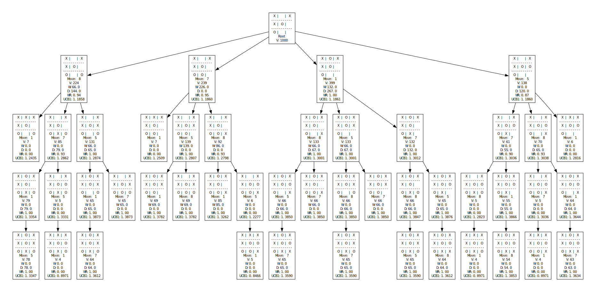

# Tic-Tac-Toe with Monte Carlo Tree Search

This project implements an AI player for the classic game of Tic-Tac-Toe using the Monte Carlo Tree Search (MCTS) algorithm. The AI provides a challenging opponent by utilizing MCTS to make intelligent decisions based on simulated game plays.



## Features

- Play Tic-Tac-Toe against an AI opponent powered by MCTS
- Visualize the MCTS decision tree as a PDF
- Adjustable search iterations for balancing decision quality and speed

## Installation

1. Clone this repository:
   ```
   git clone https://github.com/Malkus86/tic-tac-toe-mcts.git
   cd tic-tac-toe-mcts
   ```

2. Install the required dependencies:
   ```
   pip install graphviz
   ```

   Note: You also need to install Graphviz on your system. Visit the [Graphviz website](https://graphviz.org/download/) for installation instructions specific to your operating system.

## Usage

Run the game using Python:

```
python tic_tac_toe_mcts.py
```

Follow the on-screen prompts to play the game. Enter your moves by selecting a position from 0 to 8, corresponding to the Tic-Tac-Toe board layout:

```
0 | 1 | 2
---------
3 | 4 | 5
---------
6 | 7 | 8
```

After each AI turn, a PDF visualization of the decision tree ('mcts_tree.pdf') will be generated in the same directory.

## MCTS Tree Visualization

Node information in the tree:
- **Move**: AI's next move position
- **V (Visits)**: Number of times this node was visited
- **W (Wins)**: Number of wins from simulations starting at this node
- **D (Draws)**: Number of draws from simulations starting at this node
- **WR (Win Rate)**: Node evaluation metric
- **UCB1**: Value used for child node selection

## Dependencies

- Python 3.x
- Graphviz

Enjoy playing against the MCTS AI and exploring its decision-making process through the generated PDFs!